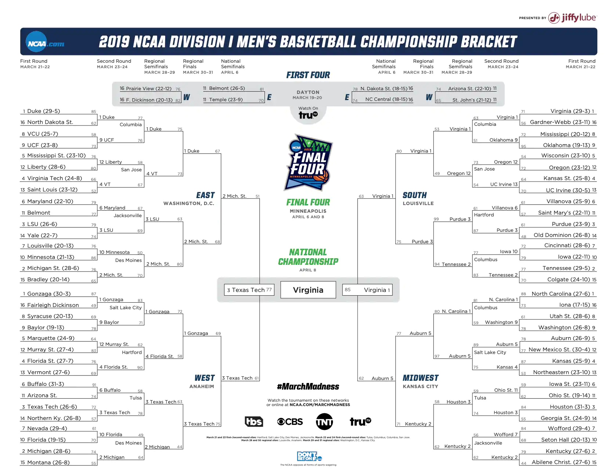

```{r setup, include=FALSE}
knitr::opts_chunk$set(cache = TRUE, message = FALSE, warning = FALSE)
library(tidyverse)
library(gganimate)
library(ggpubr)
library(jpeg)
library(grid)
library(RCurl)
library(shiny)
library(kableExtra)

#RISULTATI PARTITE 85-20 RR
dataOverAll = read_csv("MDataFiles_Stage2\\MRegularSeasonCompactResults.csv")

#TEAM DIVISION I
Team = read_csv("MDataFiles_Stage2\\MTeams.csv")

#RISULTATI PARTITE 85-20 MM
MarchMadness_All = read_csv("MDataFiles_Stage2\\MNCAATourneyCompactResults.csv")

#SEED MM 85-20
Seed = read_csv("MDataFiles_Stage2\\MNCAATourneySeeds.csv")

#RISULTATI DETTAGLIATI PARTITE 03-20
Detailed_result = read_csv("MDataFiles_Stage2\\MRegularSeasonDetailedResults.csv")

#STATISTICHE STAGIONALI NBA 03-20
Shoot_NBA = read_csv("SeasonNBA.csv") 

#PLAY BY PLAY SEASON 18-19
Season19 = read_csv("2020DataFiles\\2020DataFiles\\2020-Mens-Data\\MEvents2019.csv")

#PLAYER SEASON 2019
player2019 = read_csv("2020DataFiles\\2020DataFiles\\2020-Mens-Data/MPlayers.csv")

#HALF COURT NCAA
court <- rasterGrob(readJPEG("court.jpeg"),
                    width=unit(1,"npc"), height=unit(1,"npc"))
```

# Campionato di basket NCAA

## Division I
Il campionato di basket dell'NCAA (National Collegiate Athletic Association) è diviso in tre categorie:

* Division I 

* Division II

* Division III

## Regular Season
La prima parte di stagione, la Regular Season, si divide in due periodi:

* non conference schedule

* conference schedule

Questo periodo è fondamentale per poter giocare la seconda parte di stagione.

## March Madness
La seconda parte di stagione è divisa anch'essa in due parti:

* conference tournament

* March Madness


# Analisi del campionato tra il 1985 ed oggi

## Fattore campo
Il fattore campo è spesso considerato fondamentale, una marcia in più per la squadra di casa, che conosce lo stadio in cui viene disputata la partita, ma sopratutto ha il sostegno del pubblico amico.

```{r, echo = FALSE, fig.align = "center"}
#VITTORIE IN CASE ANNO PER ANNO
H_A = dataOverAll %>%
  filter(WLoc != "N") %>%
  group_by(Season, WLoc) %>%
  summarise(H_or_A = n()) %>%
  spread(WLoc, H_or_A) %>%
  mutate(Ratio = H/(A+H))

#PLOT PERCENTUALE NEGLI ANNI (RIMANE INVARIATA)
H_A %>%
  ggplot(aes(Season, Ratio)) +
  geom_col()+
  ggtitle("Percentale di vittoria della squadra di casa") +
  xlab("Stagione") +
  ylab("Percentuale") 
```

#### Rapporto medio di vittorie in casa

```{r, echo = FALSE}
#RAPPORTO MEDIO DI VITTORIE IN CASA 
mean(H_A$Ratio)
```

## Squadre vincenti
Ogni college cerca di attrarre i migliori talenti delle High School, in modo da essere ogni stagione sempre più competitivo.

```{r, include = FALSE}
Rank_Over_All_W = dataOverAll %>%
  group_by(WTeamID) %>%
  summarise(Win = n(), PF = sum(WScore), PS = sum(LScore)) %>%
  rename("TeamID" = WTeamID)

Rank_Over_All_L = dataOverAll %>%
  group_by(LTeamID) %>%
  summarise(Lose = n(), PS = sum(WScore), PF = sum(LScore)) %>%
  rename("TeamID" = LTeamID)

#STATISTICHE DELLE SQUADRE DALL'85 AD OGGI
Rank_Over_All = Rank_Over_All_W %>%
  inner_join(Rank_Over_All_L, by = "TeamID") %>%
  mutate(Points = Win*2, Rate = Win/(Win+Lose), PF = PF.x + PF.y, PS = PS.x + PS.y, DIFF = PF-PS, DIFFPG = DIFF/(Win+Lose)) %>%
  select(-c(PF.x, PF.y, PS.x, PS.y)) %>%
  inner_join(Team) %>%
  select(-c(FirstD1Season, LastD1Season)) %>%
  arrange(-Rate) %>%
  mutate(Rank = row_number()) %>%
  select(TeamName, everything())

Year_Stat_All_W = dataOverAll %>%
  group_by(Season, WTeamID) %>%
  summarise(Win = n(), PF = sum(WScore), PS = sum(LScore)) %>%
  rename("TeamID" = WTeamID)

Year_Stat_All_L = dataOverAll %>%
  group_by(Season, LTeamID) %>%
  summarise(Lose = n(), PS = sum(WScore), PF = sum(LScore)) %>%
  rename("TeamID" = LTeamID)

#STATISTICHE ANNO PER ANNO DELLE SQUADRE
Year_Stat_All = Year_Stat_All_W %>%
  inner_join(Year_Stat_All_L, by = c("TeamID", "Season")) %>%
  mutate(Points = Win*2, Rate = Win/(Win+Lose), PF = PF.x + PF.y, PS = PS.x + PS.y, DIFF = PF-PS, DIFFPG = DIFF/(Win+Lose)) %>%
  select(-c(PF.x, PF.y, PS.x, PS.y)) %>%
  inner_join(Team) %>%
  select(-c(FirstD1Season, LastD1Season)) 

Last10 =  Year_Stat_All %>%
  filter(Season >= 2010) %>%
  group_by(TeamName) %>%
  summarise(Win = sum(Win), Lose = sum(Lose), Rate = Win/(Win+Lose)) %>%
  arrange(-Rate) %>%
  mutate(Rank10 = row_number()) %>%
  left_join(Rank_Over_All %>%
              select(-c(TeamID:DIFFPG)), by = c("TeamName")) %>%
  mutate(Change = Rank - Rank10)
```

#### Squadre con il win rate più alto dal 1985 ad oggi

```{r, echo = FALSE}
kable(head(Rank_Over_All %>%
         select(-TeamID) %>%
       select(TeamName, Rate, Rank), 10)) %>%
  kable_styling(bootstrap_options = c("striped", "hover", "condensed", "responsive"), full_width = F)
```

## Cambiamento del gioco negli anni - Tipi di tiri effettuati

Con il passare degli anni, tra l'85 ed oggi, è anche cambiato il modo di giocare a basket, insieme alle regole e alle strategie in campo.

```{r, include = FALSE}
Shoot_NBA = Shoot_NBA %>%
  select(Season, "P2", "P3", "PFG", "PFG3")

Shoot = Detailed_result %>%
  group_by(Season) %>%
  summarise(NG = n(), FGM = (sum(WFGM)+sum(LFGM)), FGA = (sum(WFGA)+sum(LFGA)), PFG = FGM/FGA, FGM3 = (sum(WFGM3)+sum(LFGM3)), FGA3 = (sum(WFGA3)+sum(LFGA3)), PFG3 = FGM3/FGA3, P2 = FGA/(FGA+FGA3), P3 = 1 - P2, TFG = (FGA + FGA3), FPG = TFG/NG, FTM = (sum(WFTM)+sum(LFTM)), FTA = (sum(WFTA)+sum(LFTA)), PFT = FTM/FTA)

```

```{r, echo = FALSE, fig.align = "center"}
PShoot = Shoot %>%
  select(Season, P2, P3, PFG, PFG3) %>%
  mutate(Kind = "NCAA") %>%
  bind_rows(Shoot_NBA %>%
              mutate(Kind = "NBA")) %>%
  ggplot(aes(Season, P3, color = Kind, group = Kind)) +
  geom_path() +
  geom_point() +
  xlab("Stagione") +
  ylab("Percentuale") +
  ggtitle("Percentuale tiri da 3 nelle diverse stagioni") +
  theme(legend.title = element_blank()) +
  transition_reveal(Season) +
  ease_aes('linear')

animate(PShoot, duration = 8)

```

## Cambiamento del gioco negli anni - Punteggio

Le modifiche del gioco hanno influenzato però anche i punteggi?

```{r, include = FALSE}

#ANNO PER ANNO PUNTI
Year_Points = dataOverAll %>%
  mutate(TotalPoints = (WScore+LScore)/2) %>%
  group_by(Season) %>%
  summarise(Mean = mean(TotalPoints), MPW = mean(WScore), MPL = mean(LScore), DIFF = MPW-MPL)

```

```{r, echo = FALSE, fig.align = "center"}

#PLOT CON I DIVERSI TIPI DI PUNTEGGIO NEL CORSO DEGLI ANNI
Year_Points %>%
  select(-DIFF) %>%
  gather("Kind", "Value", -Season) %>%
  ggplot(aes(Season, Value, fill = Kind)) +
  geom_col(position = "dodge") +
  ggtitle("Punteggio medio partite nelle differenti stagioni") +
  xlab("Stagione") +
  ylab("Punti realizzati") + 
  theme(legend.title = element_blank())  
```


```{r, echo = FALSE, fig.align = "center"}
#PLOT CON LO SCARTO MEDIO TRA VINCENTE E PERDERNTE NEL CORSO DEGLI ANNI
Year_Points %>%
  ggplot(aes(Season, DIFF)) + 
  geom_col() +
  ggtitle("Scarto medio nelle differenti stagioni") +
  xlab("Stagione") +
  ylab("Differenza")

```

## Cambiamento del gioco negli anni - Punteggio RS-MM

La RS è giocata allo stesso modo della MM?

* MPW = Media punti team vincente

* MPL = Media punti team perdente

* MPPG = Media punti per game 

```{r, include=FALSE}
#cALCOLO DEI PUNTEGGI MEDI DURANTE LA MM
MarchMadness_Points = MarchMadness_All %>%
  group_by(Season) %>%
  summarise(MPW = mean(WScore), MPL = mean(LScore), DIFF = MPW - MPL, Mean = (MPW+MPL)/2)

Data_Plot = Year_Points %>%
  mutate(Kind = "RS") %>%
  bind_rows(MarchMadness_Points %>%
              mutate(Kind = "MM"))

#PLOT SCARTO MEDIO
P1 = Data_Plot %>%
  ggplot(aes(Season, DIFF, color = Kind, group = Kind)) +
  geom_path() +
  geom_point() +
  ggtitle("Scarto medio nelle differenti stagioni") +
  xlab("Stagione") +
  ylab("Differenza") +
  theme(legend.title = element_blank()) 

#PLOT MPW 
P2 = Data_Plot %>%
  ggplot(aes(Season, MPW, color = Kind, group = Kind)) +
  geom_path() +
  geom_point() +
  ggtitle("MPW nelle differenti stagioni") +
  xlab("Stagione") +
  ylab("Punti realizzati") +
  theme(legend.title = element_blank()) 

#PLOT MPL
P3 = Data_Plot %>%
  ggplot(aes(Season, MPL, color = Kind, group = Kind)) +
  geom_path() +
  geom_point() +
  ggtitle("MPL nelle differenti stagioni") +
  xlab("Stagione") +
  ylab("Punti realizzati") +
  theme(legend.title = element_blank())  

#PLOT MEDIA PUNTI SEGNATI DA UNA SQUADRA PER PARTITA
P4 = Data_Plot %>%
  ggplot(aes(Season, Mean, color = Kind, group = Kind)) +
  geom_path() +
  geom_point() +
  ggtitle("MPPG nelle differenti stagioni") +
  xlab("Stagione") +
  ylab("Punti realizzati") +
  theme(legend.title = element_blank())  
```

#### Diverse correlazioni tra i punteggi della RS e della MM

```{r, echo = FALSE, fig.width = 7, fig.align = "center"}
ggarrange(P1, P2, P3, P4)
```

## Round MM

Il bracket della MM è diviso in 4 Regioni, che indicano la diversa provenienza dei college.
Negli ultimi anni sono:

* East

* MiddleWest

* South

* West

Durante la March Madness si svolgono diversi round:

* top 64 - First round

* top 32 - Second round

* top 16 - Sweet Sixteen

* top 8 - Elite Eight

* top 4 - Final Four

* top 2 - Final

#### Bracket

<center>
{width=100%}
</center>

</br>
</br>

```{r, include = FALSE}
#VETTORE CHE DEFINISCE I TIPI DI ROUND
Top = rep(c(rep(1, 32), rep(2, 16), rep(3, 8), rep(4, 4), rep(5, 2), rep(6, 1)), 35)
#MARCH MADNESS CON ANNESSI ROUND E CALCOLO DEI PUNTEGGI MEDI PER ROUND
MarchMadness_Round = MarchMadness_All %>%
  filter(DayNum >= 136) %>%
  mutate(Top) %>%
  group_by(Top) %>%
  summarise(MPW = mean(WScore), MPL = mean(LScore), DIFF = MPW - MPL, Mean = (MPW+MPL)/2)

#PLOT SCARTO
P5 = MarchMadness_Round %>%
  ggplot(aes(Top, DIFF)) +
  geom_path() +
  geom_point() +
  ggtitle("Scarto medio nei diversi round della MM") +
  xlab("Round") +
  ylab("Differenza") 

#PLOT MPW
P6 = MarchMadness_Round %>%
  ggplot(aes(Top, MPW)) +
  geom_path() +
  geom_point() +
  ggtitle("MPW nei diversi round della MM") +
  xlab("Round") +
  ylab("Punti realizzati") 

#PLOT MPL
P7 = MarchMadness_Round %>%
  ggplot(aes(Top, MPL)) +
  geom_path() +
  geom_point() +
  ggtitle("MPL nei diversi round della MM") +
  xlab("Round") +
  ylab("Punti realizzati") 

#PLOT MEDIA PUNTI SEGNATI DA UNA SQUADRA
P8 = MarchMadness_Round %>%
  ggplot(aes(Top, Mean)) +
  geom_path() +
  geom_point() +
  ggtitle("MPPG nei diversi round della MM") +
  xlab("Round") +
  ylab("Punti realizzati") 
```

#### Analisi dei vari tipi di punteggio durante i round della MM

```{r, echo = FALSE, fig.width = 7, fig.align = "center"}
ggarrange(P5, P6, P7, P8)
```

## Maggior numero di presenze alla MM

Un ateneo può partecipare alla March Madness in due modi:

* vincere il Conference Tournament

* venire scelti dai Commissioner 

In questo modo vengono scelte le 64/68 squadre che parteciperanno al torneo conclusivo della manifestazione e, per ogni Regione, viene stilata una classifica dai Commissioner che indica l'assegnazione della Seed.

```{r, include = FALSE}
Seed_All = Seed %>%
  inner_join(Team) %>%
  group_by(TeamName) %>%
  summarise(N_partecipazioni = n()) %>%
  arrange(-N_partecipazioni)

Seed_10 = Seed %>%
  filter(Season >= 2010) %>%
  inner_join(Team) %>%
  group_by(TeamName) %>%
  summarise(N_partecipazioni = n()) %>%
  arrange(-N_partecipazioni)
```

#### Squadre con il maggior numero di partecipazioni alla MM dal 1985 ad oggi

```{r, echo = FALSE}
kable(head(Seed_All, 10)) %>%
  kable_styling(bootstrap_options = c("striped", "hover", "condensed", "responsive"), full_width = F)
```

#### Squadre con il maggior numero di partecipazioni alla MM negli ultimi 10 anni

```{r, echo = FALSE}
kable(head(Seed_10, 10)) %>%
  kable_styling(bootstrap_options = c("striped", "hover", "condensed", "responsive"), full_width = F)
```


## Squadre che hanno vinto di più

```{r, include = FALSE}
Championship = MarchMadness_All %>%
  filter(DayNum == 154) %>%
  group_by(WTeamID) %>%
  summarise(N_Championship = n()) %>%
  inner_join(Team, by = c("WTeamID" = "TeamID")) %>%
  select(-c(WTeamID, FirstD1Season, LastD1Season)) %>%
  arrange(-N_Championship)

```

```{r, echo = FALSE}
kable(head(Rank_Over_All %>%
  left_join(Championship) %>%
  replace_na(list(N_Championship = 0))%>%
    select(TeamName, Rank, N_Championship) %>%
    arrange(-N_Championship), 10)) %>%
  kable_styling(bootstrap_options = c("striped", "hover", "condensed", "responsive"), full_width = F)
```


# Analisi 2018-19

## Confronto del win rate con l'elo rate 

##### Modifiche apportate all'elo rating system 

Vincente squadra in casa

$update = (k  * (1 - mu*(0.66)/(0.32*mu+0.34))) * 2 / (2 - (score / maxDiff))$

Vincente squadra fuori casa

$update = (k  * (1 - mu*(1-0.66)/(0.32*mu+0.34))) * 2 / (2 - (score / maxDiff))$

* mu = calcolo match up con il classico elo rating system

* 0.66 = probabilità di vittoria da parte della squadra di casa

* score = risultato della partita come differenza tra il punteggio della squadra vincente e quello della squadra perdente

* maxDiff = mediana dell'1% dei game con la più alta differenza tra il 1985 e il 2018

```{r, include = FALSE}
#SELEZIONA L'1% DEI GAME CON LA PIU' ALTA DIFFERENZA
max_diff = dataOverAll %>%
  filter(Season != 2019 || Season != 2020) %>%
  mutate(DIFF = WScore - LScore) %>%
  arrange(-DIFF) %>%
  top_n(floor(nrow(dataOverAll)*0.01)) 

#MEDIANA DEI VALORI SELEZIONATI PRECEDENTEMENTE
max_diff =  median(max_diff$WScore - max_diff$LScore)

#RANKING IN BASE AL WIN RATE
Rank_Base = Year_Stat_All %>%
  filter(Season == 2019) %>%
  arrange(-Rate) %>%
  left_join(Seed %>%
               filter(Season == 2019) %>%
               select(-Season), by = c("TeamID")) %>%
  separate(Seed, into = c("Zone", "Pos"), sep = 1)

#ELO RATING MODIFICATO 
elo = function(games, z = 100, k = 10) {
  
  teams = unique(games[, "WTeamID"])
  n = nrow(teams)
  teams = str_split(lapply(teams, toString), ", ")[[1]]
  
  m = nrow(games)
  
  rold = as.matrix(rep(0, n))
  rownames(rold) = teams
  
  rnew = as.matrix(rep(0, n))
  rownames(rnew) = teams
  
  for (i in 1:m) {
    score = strtoi(games[i, "WScore"]) - strtoi(games[i, "LScore"])
    spread = rold[toString(games[i, "WTeamID"]), 1] - rold[toString(games[i, "LTeamID"]), 1]
    mu = 1 / (1 + 10^(-spread / z))
    if(games[i, "WLoc"] == "1") {
      update = k  * (1 - mu*(0.66)/(0.32*mu+0.34)) 
    } else if (games[i, "WLoc"] == "0") {
     update = k * (1 - mu*(1-0.66)/(0.32*mu+0.34))
    } else {
      update = k * (1 - mu) 
    }
    if(score > max_diff) {
      score = max_diff
    }
    update = update * 2 / (2 - (score / max_diff))
      
    rnew[toString(games[i, "WTeamID"]), 1] = rold[toString(games[i, "WTeamID"]), 1] + update
    
    rnew[toString(games[i, "LTeamID"]), 1] = rold[toString(games[i, "LTeamID"]), 1] - update
    
    rold[toString(games[i,"WTeamID"]), 1] = rnew[toString(games[i,"WTeamID"]), 1]
    rold[toString(games[i,"LTeamID"]), 1] = rnew[toString(games[i,"LTeamID"]), 1]
  }
  return(rnew)
}

#TIBBLE CHE CONTIENE PER OGNI GAMES LO SCARTO E SE HA VINTO LA SQUADRA DI CASA O NO
Games2019 = dataOverAll %>% 
  filter(Season == 2019) %>%
  mutate(Score = WScore - LScore) %>%
  mutate(WLoc = factor(ifelse(WLoc == "A", "0",
                              ifelse(WLoc == "H", '1', '0.5'))))

#TEAM DIVISION I 2018-19
Teams2019 = as_tibble(unique(Games2019$WTeamID)) %>%
  rename("TeamID" = value) %>%
  inner_join(Team) %>%
  select(-c(FirstD1Season, LastD1Season))

#ELO RATING SEASON 2018-19
EloRank2019 = as_tibble(elo(Games2019)) %>%
  bind_cols(Teams2019) %>%
  rename("Rate" = V1) %>%
  arrange(-Rate) %>%
  left_join(Seed %>%
              filter(Season == 2019) %>%
              select(-Season), by = c("TeamID")) %>%
  separate(Seed, into = c("Zone", "Pos"), sep = 1)

#TIBBLE DOVE E' PRESENTE SIA IL WIN RATE CHE L'ELO RATE
compare_elo = bind_rows(EloRank2019 %>%
                          filter(!is.na(Zone)) %>%
                          mutate(Rate = Rate / max(Rate)) %>%
                          mutate(Kind = "Elo"), 
                        Rank_Base %>%
                          select(c(Rate, TeamID, TeamName, Zone, Pos)) %>%
                          filter(!is.na(Zone)) %>%
                          mutate(Kind = "Base")) %>%
  mutate(Season = 2019) %>%
  arrange(Pos)

#REGIONE EAST
P9 = compare_elo %>%
  filter(Zone == "W") %>%
  filter(!is.na(Zone)) %>%
  mutate(plot = c(1:36)) %>%
  ggplot(aes(x = reorder(TeamName, plot), y = Rate, color = Kind, fill = Kind)) +
  geom_col(position = "dodge") +
  theme(axis.text.x = element_text(angle = 90, size = 10, hjust = 1)) +
  xlab("") +
  ylab("Punteggio") +
  ggtitle("Ranking squadre East") +
  theme(legend.title = element_blank())

#REGIONE WEST
P10 = compare_elo %>%
   filter(Zone == "X") %>%
   filter(!is.na(Zone)) %>%
   mutate(plot = c(1:36)) %>%
   ggplot(aes(x = reorder(TeamName, plot), y = Rate, color = Kind, fill = Kind)) +
   geom_col(position = "dodge") +
   theme(axis.text.x = element_text(angle = 90, size = 10, hjust = 1)) +
   xlab("") +
   ylab("Punteggio") +
   ggtitle("Ranking squadre West") +
   theme(legend.title = element_blank())

#REGIONE MIDWEST 
P11 = compare_elo %>%
   filter(Zone == "Y") %>%
   filter(!is.na(Zone)) %>%
   mutate(plot = c(1:32)) %>%
   ggplot(aes(x = reorder(TeamName, plot), y = Rate, color = Kind, fill = Kind)) +
   geom_col(position = "dodge") +
   xlab("") +
   theme(axis.text.x = element_text(angle = 90, size = 10, hjust = 1)) +
   ylab("Punteggio") +
   ggtitle("Ranking squadre Midwest") +
   theme(legend.title = element_blank())

#REGIONE SOUTH 
P12 = compare_elo %>%
   filter(Zone == "Z") %>%
   filter(!is.na(Zone)) %>%
   mutate(plot = c(1:32)) %>%
   ggplot(aes(x = reorder(TeamName, plot), y = Rate, color = Kind, fill = Kind)) +
   geom_col(position = "dodge") +
   theme(axis.text.x = element_text(angle = 90, size = 10, hjust = 1)) +
   xlab("") +
   ylab("Punteggio") +
   ggtitle("Ranking squadre South") +
   theme(legend.title = element_blank())
```

#### Le squadre qualificate alla MM, divise per Region ed ordinate per Seed

```{r, echo = FALSE, fig.width = 7, fig.align = "center"}
ggarrange(P9, P10, P11, P12)

```

## Comparazione Win Rate - Elo Rate - Seed

Supponendo di dover predire i risultati del bracket dello scorso anno ho utilizzato tre metodi:

1. vincente chi ha il Win Rate maggiore
2. vincente chi ha l'Elo Rate maggiore
3. vincente chi ha la Seed minore

```{r, include = FALSE}
#FUNZIONE CHE TESTA SUL BRACKET DELLO SCORSO ANNO I TRE TIPI DI METODI
test_MM = function() {
  MM2019 = MarchMadness_All %>%
    filter(Season == 2019)
  
  Rank_Base = column_to_rownames(Rank_Base, var = "TeamID")
  EloRank2019 = column_to_rownames(EloRank2019, var = "TeamID")
  
  result = c(0,0,0) #indice 1 = Base indice 2 = Elo indice 3 = Seed 
  
  for(i in 1:nrow(MM2019)) {
    W = MM2019[i, "WTeamID"][[1]]
    baseW = Rank_Base[toString(W), "Rate"][[1]]
    eloW = EloRank2019[toString(W), "Rate"][[1]]
    seedW = Rank_Base[toString(W), "Pos"][[1]]
    
    L =  MM2019[i, "LTeamID"][[1]]
    baseL = Rank_Base[toString(L), "Rate"][[1]]
    eloL = EloRank2019[toString(L), "Rate"][[1]]
    seedL = Rank_Base[toString(L), "Pos"][[1]]
    
    if(baseW >= baseL) {
      result[1] = result[1] + 1
    }
    
    if(eloW >= eloL) {
      result[2] = result[2] + 1
    }
    
    if(seedW <= seedL) {
      result[3] = result[3] + 1
    }
  }
  return(result)
} 

Base_vs_Elo = test_MM()

```

#### Numero di prediction corrette secondo i vari metodi 

```{r, echo = FALSE}
Base_vs_Elo
```

# Ja Morant

## Statistiche Ja Morant

Un *playmaker*, classe '99, molto atletico ed esplosivo, con delle doti da passatore invidiabili da chiunque, un giocatore estremamente completo. 
Lo scorso anno era la stella di Murray State, e, insieme ai suoi compagni, ha portato l'ateneo a giocarsi un posto nelle *Sweet Sixteen*, perdendo contro Florida State.

```{r, include = FALSE}

#TUTTI GLI EVENTI ASSOCIATI A JA MORANT
ja_morant = Season19 %>%
  filter(EventPlayerID == '7022') %>%
  select(EventPlayerID:Area) %>%
  group_by(EventType, EventSubType) %>%
  summarise(n = n())

```

```{r, echo = FALSE, fig.align = "center"}
#HIST PLOT CHE DESCRIVE IL NUMERO DI EVENTI 
ja_morant %>%
  group_by(EventType) %>%
  summarise(n = sum(n)) %>%
  ggplot(aes(reorder(EventType, n), n)) +
  geom_col() + 
  coord_flip() +
  xlab("") +
  ylab("Occorrenze") +
  ggtitle("Tipi di azioni effettuate da Ja Morant")
```

## Distribuzione su metà campo tiri Ja Morant

```{r, echo = FALSE, fig.align = "center"}

Season19 %>%
  filter(Area != 0 & (EventType == "made1" | EventType == "miss1" | EventType == "made2" | EventType == "miss2" | EventType == "made3" | EventType == "miss3")) %>%
  filter(EventPlayerID == '7022') %>%
  mutate(X = ifelse(X > 50, 100-X, X)) %>%
  ggplot(aes(X, Y, color = EventType)) +
  annotation_custom(court, xmin=-0, xmax=50, ymin=-0, ymax=100) + 
  geom_point(size = 4) +
  theme_void() +
  theme(legend.title = element_blank())

```

## Distribuzionione su metà campo tiri effettuati - Stagione 2018-19

```{r, echo = FALSE, fig.width = 7, fig.align = "center"}
P13 = Season19 %>%
  filter(Area != 0 & (EventType == "made1" | EventType == "miss1" | EventType == "made2" | EventType == "miss2" | EventType == "made3" | EventType == "miss3")) %>%
  mutate(X = ifelse(X > 50, 100-X, X)) %>%
  ggplot(aes(X, Y, color = EventType)) +
  annotation_custom(court, xmin=-0, xmax=50, ymin=-0, ymax=100) + 
  geom_point(size = 1) +
  theme_void() +
  ggtitle("Tiri registrati") +
  theme(legend.title = element_blank(),
        plot.title = element_text(hjust = 0.5)) 

 P14 = Season19 %>%
  filter(Area != 0 & (EventType == "made1" | EventType == "miss1" | EventType == "made2" | EventType == "miss2" | EventType == "made3" | EventType == "miss3")) %>%
  mutate(X = ifelse(X > 50, 100-X, X)) %>%
  ggplot(aes(X, Y)) +
  annotation_custom(court, xmin=-0, xmax=50, ymin=-0, ymax=100) + 
  geom_hex() +
  scale_fill_continuous(type = "viridis") +
  theme_void() +
  ggtitle("Heatmap dei tiri effettuati") +
  theme(legend.title = element_blank(),
        plot.title = element_text(hjust = 0.5)) 


P15 = Season19 %>%
  filter(Area != 0 & (EventType == "made1" | EventType == "made2" | EventType == "made3" )) %>%
  mutate(X = ifelse(X > 50, 100-X, X)) %>%
  ggplot(aes(X, Y)) +
  annotation_custom(court, xmin=-0, xmax=50, ymin=-0, ymax=100) + 
  geom_hex() +
  scale_fill_continuous(type = "viridis") +
  theme_void() +
  ggtitle("Heatmap dei tiri realizzati") +
  theme(legend.title = element_blank(),
        plot.title = element_text(hjust = 0.5)) 


P16 = Season19 %>%
  filter(Area != 0 & (EventType == "miss1" | EventType == "miss2" | EventType == "miss3" )) %>%
  mutate(X = ifelse(X > 50, 100-X, X)) %>%
  ggplot(aes(X, Y)) +
  annotation_custom(court, xmin=-0, xmax=50, ymin=-0, ymax=100) + 
  geom_hex() +
  scale_fill_continuous(type = "viridis") +
  theme_void() +
  ggtitle("Heatmap dei tiri sbagliati") +
  theme(legend.title = element_blank(),
        plot.title = element_text(hjust = 0.5)) 

ggarrange(P13, P14, P15, P16)

```


# STATISTICHE GIOCATORI 2018-19

## Shiny

```{r, cache = FALSE, echo = FALSE}
shinyAppFile("C:\\Users\\gabri\\OneDrive\\Documenti\\GitHub\\Progetto-Data-Science-Gabriele-Dominici\\app.R")
```

