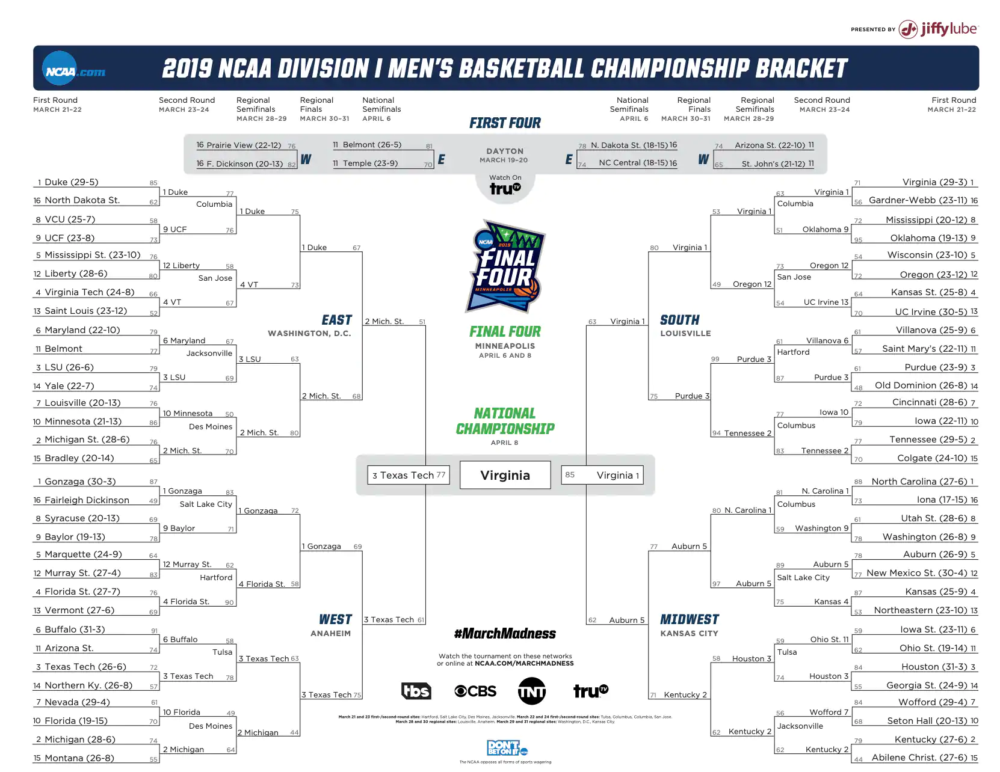

```{r setup, include=FALSE}
knitr::opts_chunk$set(cache = TRUE, message = FALSE, warning = FALSE)
library(tidyverse)
library(gganimate)
library(ggpubr)
library(jpeg)
library(grid)
library(RCurl)
library(shiny)

#RISULTATI PARTITE 85-20 RR
dataOverAll = read_csv("MDataFiles_Stage2\\MRegularSeasonCompactResults.csv")

#TEAM DIVISION I
Team = read_csv("MDataFiles_Stage2\\MTeams.csv")

#RISULTATI PARTITE 85-20 MM
MarchMadness_All = read_csv("MDataFiles_Stage2\\MNCAATourneyCompactResults.csv")

#SEED MM 85-20
Seed = read_csv("MDataFiles_Stage2\\MNCAATourneySeeds.csv")

#RISULTATI DETTAGLIATI PARTITE 03-20
Detailed_result = read_csv("MDataFiles_Stage2\\MRegularSeasonDetailedResults.csv")

#STATISTICHE STAGIONALI NBA 03-20
Shoot_NBA = read_csv("SeasonNBA.csv") 

#PLAY BY PLAY SEASON 18-19
Season19 = read_csv("2020DataFiles\\2020DataFiles\\2020-Mens-Data\\MEvents2019.csv")

#PLAYER SEASON 2019
player2019 = read_csv("2020DataFiles\\2020DataFiles\\2020-Mens-Data/MPlayers.csv")

#HALF COURT NCAA
court <- rasterGrob(readJPEG("court.jpeg"),
                    width=unit(1,"npc"), height=unit(1,"npc"))
```

# Campionato di basket NCAA

## Division I
Il campionato di basket dell'NCAA (National Collegiate Athletic Association) è diviso in tre categorie:

* Division I 

* Division II

* Division III

La principale, la Division I, raggruppa circa 350 tra le migliori squadre di college degli Stati Uniti, divise in 32 Conference (8 o 16 squadre).

Tra i giocatori di queste squadre troviamo i futuri professionisti del campionato di basket più famoso al mondo, l'NBA

## Regular Season
Il campionato NCAA comincia i primi di novembre e si conclude al termine di marzo.
Nella prima parte di stagione, chaiamata Regular Season, si distinguono due periodi:

* non conference schedule: in cui ogni college decide il proprio calendario, scegliendo che squadre affrontare

* conference schedule: in cui ogni college gioca almeno una partita contro ogni altra squadra appartenente alla sua Conference

Questo periodo è fondamentale per poter giocare la seconda parte di stagione

## March Madness
La seconda parte di stagione è quella più importante ed è divisa anch'essa in due parti:

* conference tournament: in cui ogni squadra partecipa al torneo della propria Conference, nel quale viene definito il campione stagionale di tale Conference

* March Madness: in cui le migliori 64 squadre di college si sfidano per ottenere l'ambito premio

Quest'ultima si svolge tra marzo e l'inizio di aprile ed è uno degli eventi più seguiti dell'anno negli Stati Uniti

# Analisi del campionato tra il 1985 ed oggi

## Fattore campo
Il fattore campo è spesso considerato fondamentale, una marcia in più per la squadra di casa, che conosce lo stadio in cui viene disputata la partita, ma sopratutto ha il sostegno del pubblico amico.

Con il passare degli anni l'NCAA è sempre più seguita in America e, spesso, alcuni biglietti, per delle normali partite di college, vengono venduti a prezzi folli, più alti rispetto a quelli di alcune partite NBA. Le partite delle squadre più blasonate, inoltre, sono quasi sempre sold out, creando quindi un ambiente molto suggestivo per i giocatori, i quali si ritrovano a giocare sotto gli occhi di migliaia di persone.


```{r, echo = FALSE, fig.align = "center"}
#VITTORIE IN CASE ANNO PER ANNO
H_A = dataOverAll %>%
  filter(WLoc != "N") %>%
  group_by(Season, WLoc) %>%
  summarise(H_or_A = n()) %>%
  spread(WLoc, H_or_A) %>%
  mutate(Ratio = H/(A+H))

#PLOT PERCENTUALE NEGLI ANNI (RIMANE INVARIATA)
H_A %>%
  ggplot(aes(Season, Ratio)) +
  geom_col()+
  ggtitle("Percentale di vittoria della squadra di casa") +
  xlab("Stagione") +
  ylab("Percentuale") 
```

Dal grafico possiamo notare che il fattore campo ha avuto sempre una componente fondamentale, durante lo svolgimento delle partite, il quale non è stato influenzato dall'incremento di interesse e dall'afflusso di tifosi.

#### Rapporto medio di vittorie in casa

```{r, echo = FALSE}
#RAPPORTO MEDIO DI VITTORIE IN CASA 
mean(H_A$Ratio)
```

## Squadre vincenti
In molti college è di fondamentale importanza il campionato di NCAA e molto spesso offrono ai ragazzi più promettenti delle High School, ma anche a giocatori provenienti dal resto del mondo, numerose borse di studio, per attrarli a giocare nelle loro sedi. Spesso però le squadre più blasonate sono anche quelle in grado di attrarre i talenti migliori e, di conseguenza, ogni anno avere squadre sempre più competitive.

```{r, include = FALSE}
Rank_Over_All_W = dataOverAll %>%
  group_by(WTeamID) %>%
  summarise(Win = n(), PF = sum(WScore), PS = sum(LScore)) %>%
  rename("TeamID" = WTeamID)

Rank_Over_All_L = dataOverAll %>%
  group_by(LTeamID) %>%
  summarise(Lose = n(), PS = sum(WScore), PF = sum(LScore)) %>%
  rename("TeamID" = LTeamID)

#STATISTICHE DELLE SQUADRE DALL'85 AD OGGI
Rank_Over_All = Rank_Over_All_W %>%
  inner_join(Rank_Over_All_L, by = "TeamID") %>%
  mutate(Points = Win*2, Rate = Win/(Win+Lose), PF = PF.x + PF.y, PS = PS.x + PS.y, DIFF = PF-PS, DIFFPG = DIFF/(Win+Lose)) %>%
  select(-c(PF.x, PF.y, PS.x, PS.y)) %>%
  inner_join(Team) %>%
  select(-c(FirstD1Season, LastD1Season)) %>%
  arrange(-Rate) %>%
  mutate(Rank = row_number()) %>%
  select(TeamName, everything())

Year_Stat_All_W = dataOverAll %>%
  group_by(Season, WTeamID) %>%
  summarise(Win = n(), PF = sum(WScore), PS = sum(LScore)) %>%
  rename("TeamID" = WTeamID)

Year_Stat_All_L = dataOverAll %>%
  group_by(Season, LTeamID) %>%
  summarise(Lose = n(), PS = sum(WScore), PF = sum(LScore)) %>%
  rename("TeamID" = LTeamID)

#STATISTICHE ANNO PER ANNO DELLE SQUADRE
Year_Stat_All = Year_Stat_All_W %>%
  inner_join(Year_Stat_All_L, by = c("TeamID", "Season")) %>%
  mutate(Points = Win*2, Rate = Win/(Win+Lose), PF = PF.x + PF.y, PS = PS.x + PS.y, DIFF = PF-PS, DIFFPG = DIFF/(Win+Lose)) %>%
  select(-c(PF.x, PF.y, PS.x, PS.y)) %>%
  inner_join(Team) %>%
  select(-c(FirstD1Season, LastD1Season)) 

Last10 =  Year_Stat_All %>%
  filter(Season >= 2010) %>%
  group_by(TeamName) %>%
  summarise(Win = sum(Win), Lose = sum(Lose), Rate = Win/(Win+Lose)) %>%
  arrange(-Rate) %>%
  mutate(Rank10 = row_number()) %>%
  left_join(Rank_Over_All %>%
              select(-c(TeamID:DIFFPG)), by = c("TeamName")) %>%
  mutate(Change = Rank - Rank10)
```

#### Squadre con il win rate più alto dal 1985 ad oggi

```{r, echo = FALSE}
head(Rank_Over_All %>%
         select(-TeamID), 10)
```

Nella tabella vediamo le squadre che dal 1985 ad oggi hanno performato meglio. Nelle prime posizioni sono presenti atenei di grandissima fama come Kansas (dove hanno giocato Paul Pierce, Joel Embiid, Wilt Chamberlain ...), Duke (Zion Williamson, Kyrie Irving, Jayson Tatum ...) oppure Kentucky (Anthony Davis, John Wall, DeMarcus Cousins) che negli anni hanno sfornato moltissimi talenti

#### Squadre che hanno performato meglio negli ultimi 10 anni rispetto a prima

```{r, echo = FALSE}
head(Last10 %>%
  arrange(-Change), 10)
```

Qui troviamo le migliori dieci squadre che hanno performato meglio negli ultimi 10 anni rispetto a prima. Alcune squadre nella precedente tabella erano posizionate molto in basso e, grazie a delle ottime ultime stagion, sono riuscite a risalire il ranking. Menzione speciale la meritano Harvard, Buffalo e San Diego St.

#### Confronto con le posizioni delle top 10 squadre negli ultimi 10 anni rispetto a prima

```{r, echo = FALSE}
head(Last10 %>%
  filter(Rank10 <= 10) %>%
  arrange(-Change), 10)
```

Questa volta vediamo come erano posizionate nella classifica dal 1985 ad oggi le squadre nella top 10 degli ultimi 10 anni. 

#### Confronto con le posizioni negli ultimi 10 anni delle top 10 squadre dal 1985 ad oggi

```{r, echo = FALSE}
head(Last10 %>%
  filter(Rank <= 10) %>%
  arrange(-Change), 10)
```

Mentre ora, vediamo l'esatto opposto, notando la scalata di Gonzaga che si attesta in prima posizione negli ultimi 10 anni, in cui è stata per la maggior parte delle volte una contender, senza mai, però, vincere un titolo. 

## Cambiamento del gioco negli anni - Tipi di tiri effettuati

Con il passare degli anni, tra l'85 ed oggi, è anche cambiato il modo di giocare a basket, insieme alle regole e alle strategie in campo.
Negli anni il tiro da tre nel basket è diventato sempre più presente, influenzando le difese, i movimenti in campo, ma sopratutto il modo di allenarsi, cercando di affinare anche questo aspetto, che in passato era un tipo di azione dedicato alle *guardie*.

```{r, include = FALSE}
Shoot_NBA = Shoot_NBA %>%
  select(Season, "P2", "P3", "PFG", "PFG3")

Shoot = Detailed_result %>%
  group_by(Season) %>%
  summarise(NG = n(), FGM = (sum(WFGM)+sum(LFGM)), FGA = (sum(WFGA)+sum(LFGA)), PFG = FGM/FGA, FGM3 = (sum(WFGM3)+sum(LFGM3)), FGA3 = (sum(WFGA3)+sum(LFGA3)), PFG3 = FGM3/FGA3, P2 = FGA/(FGA+FGA3), P3 = 1 - P2, TFG = (FGA + FGA3), FPG = TFG/NG, FTM = (sum(WFTM)+sum(LFTM)), FTA = (sum(WFTA)+sum(LFTA)), PFT = FTM/FTA)

```

```{r, echo = FALSE, fig.align = "center"}
PShoot = Shoot %>%
  select(Season, P2, P3, PFG, PFG3) %>%
  mutate(Kind = "NCAA") %>%
  bind_rows(Shoot_NBA %>%
              mutate(Kind = "NBA")) %>%
  ggplot(aes(Season, P3, color = Kind, group = Kind)) +
  geom_path() +
  geom_point() +
  xlab("Stagione") +
  ylab("Percentuale") +
  ggtitle("Percentuale tiri da 3 nelle diverse stagioni") +
  theme(legend.title = element_blank()) +
  transition_reveal(Season) +
  ease_aes('linear')

animate(PShoot, duration = 8)

```

In questa animazione, che confronta la situazione in NBA con quella in NCAA, sul fronte della percentuale di tiri da 3 presi durante una partita, mostra molto chiaramente che in entrambi i casi c'è un incremento netto, nel primo caso si passa dal 18% al 38%, nel secondo dal 24% al 28%.
Questo cambiamento ci può mostrare come il basket NCAA sia molto più equilibrato, nel gioco, rispetto a quello NBA che, negli anni, è passato dal basket giocato nel *pitturato* a quello dietro l'*arco*, passando da un'estremo all'altro. Questo cambiamento è iniziato nei primi anni 2000, ma si è instaurato in seguito ai draft della seconda decade, con l'arrivo nella lega di giocatori del calibro di Steph Curry, Klay Thompson e James Harden, i quali fondano la loro carriera su questo tipo di tiro.

## Cambiamento del gioco negli anni - Punteggio

Le modifiche del gioco hanno influenzato però anche i punteggi?

```{r, include = FALSE}

#ANNO PER ANNO PUNTI
Year_Points = dataOverAll %>%
  mutate(TotalPoints = (WScore+LScore)/2) %>%
  group_by(Season) %>%
  summarise(Mean = mean(TotalPoints), MPW = mean(WScore), MPL = mean(LScore), DIFF = MPW-MPL)

```

```{r, echo = FALSE, fig.align = "center"}

#PLOT CON I DIVERSI TIPI DI PUNTEGGIO NEL CORSO DEGLI ANNI
Year_Points %>%
  select(-DIFF) %>%
  gather("Kind", "Value", -Season) %>%
  ggplot(aes(Season, Value, fill = Kind)) +
  geom_col(position = "dodge") +
  ggtitle("Punteggio medio partite nelle differenti stagioni") +
  xlab("Stagione") +
  ylab("Punti realizzati") + 
  theme(legend.title = element_blank())  
```

I punteggi nel corso degli anni sono altalenanti, ma tutti i tipi di punteggi (Media punti segnati, Media punti segnati dalla squadra vincitrice e Media punti segnati dalla squadra perdente) non subiscono nè trend rialzisti, nè ribassisiti, questo ci fa presupporre che lo scarto medio delle partite negli anni è rimasto pressochè invariato (MPW - MPL).

```{r, echo = FALSE, fig.align = "center"}
#PLOT CON LO SCARTO MEDIO TRA VINCENTE E PERDERNTE NEL CORSO DEGLI ANNI
Year_Points %>%
  ggplot(aes(Season, DIFF)) + 
  geom_col() +
  ggtitle("Scarto medio nelle differenti stagioni") +
  xlab("Stagione") +
  ylab("Differenza")

```

## Cambiamento del gioco negli anni - Punteggio RS-MM
Il gioco è stato indubbiamente influenzato, ma nel complesso il punteggio medio delle partite è rimasto stabile.
Nonostante questo c'è un'aspetto fondamentale da considerare: la RS è giocata allo stesso modo della MM?
Le migliori 64 squadre della nazione si fronteggiano per ottenere l'ambito trofeo, le partite dovrebbero essere più serrate ed equilibrate.

* MPW = Media punti team vincente

* MPL = Media punti team perdente

* MPPG = Media punti per game 

```{r, include=FALSE}
#cALCOLO DEI PUNTEGGI MEDI DURANTE LA MM
MarchMadness_Points = MarchMadness_All %>%
  group_by(Season) %>%
  summarise(MPW = mean(WScore), MPL = mean(LScore), DIFF = MPW - MPL, Mean = (MPW+MPL)/2)

Data_Plot = Year_Points %>%
  mutate(Kind = "RS") %>%
  bind_rows(MarchMadness_Points %>%
              mutate(Kind = "MM"))

#PLOT SCARTO MEDIO
P1 = Data_Plot %>%
  ggplot(aes(Season, DIFF, color = Kind, group = Kind)) +
  geom_path() +
  geom_point() +
  ggtitle("Scarto medio nelle differenti stagioni") +
  xlab("Stagione") +
  ylab("Differenza") +
  theme(legend.title = element_blank()) 

#PLOT MPW 
P2 = Data_Plot %>%
  ggplot(aes(Season, MPW, color = Kind, group = Kind)) +
  geom_path() +
  geom_point() +
  ggtitle("MPW nelle differenti stagioni") +
  xlab("Stagione") +
  ylab("Punti realizzati") +
  theme(legend.title = element_blank()) 

#PLOT MPL
P3 = Data_Plot %>%
  ggplot(aes(Season, MPL, color = Kind, group = Kind)) +
  geom_path() +
  geom_point() +
  ggtitle("MPL nelle differenti stagioni") +
  xlab("Stagione") +
  ylab("Punti realizzati") +
  theme(legend.title = element_blank())  

#PLOT MEDIA PUNTI SEGNATI DA UNA SQUADRA PER PARTITA
P4 = Data_Plot %>%
  ggplot(aes(Season, Mean, color = Kind, group = Kind)) +
  geom_path() +
  geom_point() +
  ggtitle("MPPG nelle differenti stagioni") +
  xlab("Stagione") +
  ylab("Punti realizzati") +
  theme(legend.title = element_blank())  
```

#### Diverse correlazioni tra i punteggi della RS e della MM

```{r, echo = FALSE, fig.height = 12, fig.width = 12, fig.align = "center"}
ggarrange(P1, P2, P3, P4)
```

Nel grafico in alto a sinistra possiamo notare come lo scarto medio nelle partite della MM è molto altalenante negli anni, ma la maggior parte delle volte è al di sotto della media della RS, ciò conferma il presentimento di partite più equilibrate.

Negli altri 3 grafici vediamo come i punteggi medi durante la MM seguonono l'andamento di quelli della RR. 

## Round MM

Il bracket della MM è diviso in 4 Regioni, che indicano la diversa provenienza dei college.
Negli ultimi anni sono:

* East

* MiddleWest

* South

* West

Durante la March Madness si svolgono diversi round:

* top 64 - First round

* top 32 - Second round

* top 16 - Sweet Sixteen

* top 8 - Elite Eight

* top 4 - Final Four

* top 2 - Final

#### Bracket

<center>
{width=100%}
</center>

</br>
</br>
Se tra RR e MM notavamo delle piccole differenze in termini di punteggio, a maggior ragione ce le aspettiamo tra i differenti Round

```{r, include = FALSE}
#VETTORE CHE DEFINISCE I TIPI DI ROUND
Top = rep(c(rep(1, 32), rep(2, 16), rep(3, 8), rep(4, 4), rep(5, 2), rep(6, 1)), 35)
#MARCH MADNESS CON ANNESSI ROUND E CALCOLO DEI PUNTEGGI MEDI PER ROUND
MarchMadness_Round = MarchMadness_All %>%
  filter(DayNum >= 136) %>%
  mutate(Top) %>%
  group_by(Top) %>%
  summarise(MPW = mean(WScore), MPL = mean(LScore), DIFF = MPW - MPL, Mean = (MPW+MPL)/2)

#PLOT SCARTO
P5 = MarchMadness_Round %>%
  ggplot(aes(Top, DIFF)) +
  geom_path() +
  geom_point() +
  ggtitle("Scarto medio nei diversi round della MM") +
  xlab("Round") +
  ylab("Differenza") 

#PLOT MPW
P6 = MarchMadness_Round %>%
  ggplot(aes(Top, MPW)) +
  geom_path() +
  geom_point() +
  ggtitle("MPW nei diversi round della MM") +
  xlab("Round") +
  ylab("Punti realizzati") 

#PLOT MPL
P7 = MarchMadness_Round %>%
  ggplot(aes(Top, MPL)) +
  geom_path() +
  geom_point() +
  ggtitle("MPL nei diversi round della MM") +
  xlab("Round") +
  ylab("Punti realizzati") 

#PLOT MEDIA PUNTI SEGNATI DA UNA SQUADRA
P8 = MarchMadness_Round %>%
  ggplot(aes(Top, Mean)) +
  geom_path() +
  geom_point() +
  ggtitle("MPPG nei diversi round della MM") +
  xlab("Round") +
  ylab("Punti realizzati") 
```

#### Analisi dei vari tipi di punteggio durante i round della MM

```{r, echo = FALSE, fig.height = 12, fig.width = 12, fig.align = "center"}
ggarrange(P5, P6, P7, P8)
```

Infatti vediamo come con il passare dei round (più ci avviciniamo alla finale) e più lo scarto medio diventa piccolo, sintomo di partite sempre più agguerrite. 

Abbassandosi lo scarto medio anche il punteggio medio della squadra vincente e quello della squadra perdente devono avvicinarsi; infatti nel grafico in alto a destra vediamo diminuire, leggermente il primo e, nel grafico in basso a sinistra, alzarsi di molto quello della squadra perdente. Azzardando una conclusione potremmo dire che, con il passare dei round, il livello difensivo rimane invariato, mentre quello offensivo si alza di molto.

## Maggior numero di presenze alla MM

Un ateneo può partecipare alla March Madness in due modi:

* vincere il Conference Tournament

* venire scelti dai Commissioner (esperti di basket scelti ogni 5 anni) la domenica precedente alla MM

In questo modo vengono scelte le 64/68 squadre che parteciperanno al torneo conclusivo della manifestazione e, per ogni Regione, viene stilata una classifica dai Commissioner che indica l'assegnazione della seed (il posto all'interno del bracket)

```{r, include = FALSE}
Seed_All = Seed %>%
  inner_join(Team) %>%
  group_by(TeamName) %>%
  summarise(N_partecipazioni = n()) %>%
  arrange(-N_partecipazioni)

Seed_10 = Seed %>%
  filter(Season >= 2010) %>%
  inner_join(Team) %>%
  group_by(TeamName) %>%
  summarise(N_partecipazioni = n()) %>%
  arrange(-N_partecipazioni)
```

#### Squadre con il maggior numero di partecipazioni alla MM dal 1985 ad oggi

```{r, echo = FALSE}
head(Seed_All, 10)
```

Le sopracitate Duke e Kansas negli ultimi 35 anni hanno perso solamente una convocazione alla MM.
A seguire, comunque, troviamo atenei con un win rate molto alto, infatti 7 su 10 sono presenti nella top 10 del ranking dal 1985 ad oggi

#### Squadre con il maggior numero di partecipazioni alla MM negli ultimi 10 anni

```{r, echo = FALSE}
head(Seed_10, 10)
```

Non stupisce la presenza al primo posto di Duke e Kansas, ma lo fa la presenza al primo posto di Gonzaga, assente nella tabella precedente. Quest'ultimo fatto conferma, come già detto, le ottime prestazioni di questa franchigia negli ultimi 10 anni.

## Squadre che hanno vinto di più

```{r, include = FALSE}
Championship = MarchMadness_All %>%
  filter(DayNum == 154) %>%
  group_by(WTeamID) %>%
  summarise(N_Championship = n()) %>%
  inner_join(Team, by = c("WTeamID" = "TeamID")) %>%
  select(-c(WTeamID, FirstD1Season, LastD1Season)) %>%
  arrange(-N_Championship)

```

```{r, echo = FALSE}
head(Rank_Over_All %>%
  left_join(Championship) %>%
  replace_na(list(N_Championship = 0))%>%
    select(TeamName, Rank, N_Championship) %>%
    arrange(-N_Championship), 10)
```

Ai primi due posti troviamo due dei college che hanno partecipato a più MM, sono sempre stati considerati tra i migliori atenei d'America anche per la loro continuità e la solidità dimostrata negli anni.
Nonostante questo, non sono le due squadre più vincenti dell'NCAA, in quanto UCLA ha vinto ben 7 titoli, ma tutti prima del 1985.
Tra le 10 posizioni ce ne sono due particolarmente interessanti: 

* alla posizione numero 3 troviamo l'Università del Connecticut con ben 4 titoli; negli anni ha partecipato a diversi tornei di fine stagione, ma negli ultimi 10 solamente a 4 concretizzandone 2 di essi

* alla posizione numero 5 c'è Villanova, un college che si è messo in mostra negli ultimi 10 anni, partecipando a 9 MM e vincendone 2 di esse.

# Analisi 2018-19

Ho voluto analizzare la stagione 2018-19 da un altro punto di vista, avendo già visto in precedenza alcune statistiche riguardanti questa stagione. Ho calcolato, prima, il win rate di ogni college e poi l'ho confrontato con l'elo rate calcolato con la classica funzione, apportandone qualche modifica. 

Vincente squadra in casa
$update = (k  * (1 - mu*(0.66)/(0.32*mu+0.34))) * 2 / (2 - (score / maxDiff))$

Vincente squadra fuori casa
$update = (k  * (1 - mu*(1-0.66)/(0.32*mu+0.34))) * 2 / (2 - (score / maxDiff))$

* mu = calcolo match up con il classico elo rating system

* 0.66 = probabilità di vittoria da parte della squadra di casa

* score = risultato della partita come differenza tra il punteggio della squadra vincente e quello della squadra perdente

* maxDiff = mediana dell'1% dei game con la più alta differenza tra il 1985 e il 2018

In questo modo prendo in considerazione anche il fattore campo e lo scarto con cui è terminata la partita.

```{r, include = FALSE}
#SELEZIONA L'1% DEI GAME CON LA PIU' ALTA DIFFERENZA
max_diff = dataOverAll %>%
  filter(Season != 2019 || Season != 2020) %>%
  mutate(DIFF = WScore - LScore) %>%
  arrange(-DIFF) %>%
  top_n(floor(nrow(dataOverAll)*0.01)) 

#MEDIANA DEI VALORI SELEZIONATI PRECEDENTEMENTE
max_diff =  median(max_diff$WScore - max_diff$LScore)

#RANKING IN BASE AL WIN RATE
Rank_Base = Year_Stat_All %>%
  filter(Season == 2019) %>%
  arrange(-Rate) %>%
  left_join(Seed %>%
               filter(Season == 2019) %>%
               select(-Season), by = c("TeamID")) %>%
  separate(Seed, into = c("Zone", "Pos"), sep = 1)

#ELO RATING MODIFICATO 
elo = function(games, z = 100, k = 10) {
  
  teams = unique(games[, "WTeamID"])
  n = nrow(teams)
  teams = str_split(lapply(teams, toString), ", ")[[1]]
  
  m = nrow(games)
  
  rold = as.matrix(rep(0, n))
  rownames(rold) = teams
  
  rnew = as.matrix(rep(0, n))
  rownames(rnew) = teams
  
  for (i in 1:m) {
    score = strtoi(games[i, "WScore"]) - strtoi(games[i, "LScore"])
    spread = rold[toString(games[i, "WTeamID"]), 1] - rold[toString(games[i, "LTeamID"]), 1]
    mu = 1 / (1 + 10^(-spread / z))
    if(games[i, "WLoc"] == "1") {
      update = k  * (1 - mu*(0.66)/(0.32*mu+0.34)) 
    } else if (games[i, "WLoc"] == "0") {
     update = k * (1 - mu*(1-0.66)/(0.32*mu+0.34))
    } else {
      update = k * (1 - mu) 
    }
    if(score > max_diff) {
      score = max_diff
    }
    update = update * 2 / (2 - (score / max_diff))
      
    rnew[toString(games[i, "WTeamID"]), 1] = rold[toString(games[i, "WTeamID"]), 1] + update
    
    rnew[toString(games[i, "LTeamID"]), 1] = rold[toString(games[i, "LTeamID"]), 1] - update
    
    rold[toString(games[i,"WTeamID"]), 1] = rnew[toString(games[i,"WTeamID"]), 1]
    rold[toString(games[i,"LTeamID"]), 1] = rnew[toString(games[i,"LTeamID"]), 1]
  }
  return(rnew)
}

#TIBBLE CHE CONTIENE PER OGNI GAMES LO SCARTO E SE HA VINTO LA SQUADRA DI CASA O NO
Games2019 = dataOverAll %>% 
  filter(Season == 2019) %>%
  mutate(Score = WScore - LScore) %>%
  mutate(WLoc = factor(ifelse(WLoc == "A", "0",
                              ifelse(WLoc == "H", '1', '0.5'))))

#TEAM DIVISION I 2018-19
Teams2019 = as_tibble(unique(Games2019$WTeamID)) %>%
  rename("TeamID" = value) %>%
  inner_join(Team) %>%
  select(-c(FirstD1Season, LastD1Season))

#ELO RATING SEASON 2018-19
EloRank2019 = as_tibble(elo(Games2019)) %>%
  bind_cols(Teams2019) %>%
  rename("Rate" = V1) %>%
  arrange(-Rate) %>%
  left_join(Seed %>%
              filter(Season == 2019) %>%
              select(-Season), by = c("TeamID")) %>%
  separate(Seed, into = c("Zone", "Pos"), sep = 1)

#TIBBLE DOVE E' PRESENTE SIA IL WIN RATE CHE L'ELO RATE
compare_elo = bind_rows(EloRank2019 %>%
                          filter(!is.na(Zone)) %>%
                          mutate(Rate = Rate / max(Rate)) %>%
                          mutate(Kind = "Elo"), 
                        Rank_Base %>%
                          select(c(Rate, TeamID, TeamName, Zone, Pos)) %>%
                          filter(!is.na(Zone)) %>%
                          mutate(Kind = "Base")) %>%
  mutate(Season = 2019) %>%
  arrange(Pos)

#REGIONE EAST
P9 = compare_elo %>%
  filter(Zone == "W") %>%
  filter(!is.na(Zone)) %>%
  mutate(plot = c(1:36)) %>%
  ggplot(aes(x = reorder(TeamName, plot), y = Rate, color = Kind, fill = Kind)) +
  geom_col(position = "dodge") +
  theme(axis.text.x = element_text(angle = 90, size = 10, hjust = 1)) +
  xlab("") +
  ylab("Punteggio") +
  ggtitle("Ranking squadre East ordinate per Seed") +
  theme(legend.title = element_blank())

#REGIONE WEST
P10 = compare_elo %>%
   filter(Zone == "X") %>%
   filter(!is.na(Zone)) %>%
   mutate(plot = c(1:36)) %>%
   ggplot(aes(x = reorder(TeamName, plot), y = Rate, color = Kind, fill = Kind)) +
   geom_col(position = "dodge") +
   theme(axis.text.x = element_text(angle = 90, size = 10, hjust = 1)) +
   xlab("") +
   ylab("Punteggio") +
   ggtitle("Ranking squadre West ordinate per Seed") +
   theme(legend.title = element_blank())

#REGIONE MIDWEST 
P11 = compare_elo %>%
   filter(Zone == "Y") %>%
   filter(!is.na(Zone)) %>%
   mutate(plot = c(1:32)) %>%
   ggplot(aes(x = reorder(TeamName, plot), y = Rate, color = Kind, fill = Kind)) +
   geom_col(position = "dodge") +
   xlab("") +
   theme(axis.text.x = element_text(angle = 90, size = 10, hjust = 1)) +
   ylab("Punteggio") +
   ggtitle("Ranking squadre Midwest ordinate per Seed") +
   theme(legend.title = element_blank())

#REGIONE SOUTH 
P12 = compare_elo %>%
   filter(Zone == "Z") %>%
   filter(!is.na(Zone)) %>%
   mutate(plot = c(1:32)) %>%
   ggplot(aes(x = reorder(TeamName, plot), y = Rate, color = Kind, fill = Kind)) +
   geom_col(position = "dodge") +
   theme(axis.text.x = element_text(angle = 90, size = 10, hjust = 1)) +
   xlab("") +
   ylab("Punteggio") +
   ggtitle("Ranking squadre South ordinate per Seed") +
   theme(legend.title = element_blank())
```

#### Le squadre qualificate alla MM, divise per Region ed ordinate per Seed

```{r, echo = FALSE,  fig.height = 12, fig.width = 12, fig.align = "center"}
ggarrange(P9, P10, P11, P12)

```

In questi grafici, uno per ogni Region, sono presenti le 68 squadre scelte dai Commissioner, per partecipare alla MM. 
In ogni grafico, gli atenei sono disposti rispetto alla Seed a loro assegnata (a sinistra la Seed n.1).
Possiamo notare come le scelte fatte da questa commissione non rispecchiano nè un ordinamento basato sul win rate, nè uno basato sull'elo rate, il quale pesa in modo differente il risultato di una partita, correlandolo all'avversario, al campo di gioco e allo scarto. 32 squadre vengono ammesse attravero la vittoria del Conference Tournament, alcune di queste leghe, però sono considerate di livello minore rispetto ad altre; questo spiega il perchè ci sono squadre con un win rate alto (campioni di Conference) a cui, però, viene assegnata una seed più alta rispetto ad altre squadre, partecipanti a leghe più competitive, con win rate minore.
Questa ipotesi è confermata da diverse vincitrici di Conference come Vermont, New Mexico ST, UC Irvine e Liberty.

## Comparazione Win Rate - Elo Rate - Seed

Supponendo di dover predire i risultati del bracket dello scorso anno ho utilizzato tre metodi:

1. vincente chi ha il Win Rate maggiore
2. vincente chi ha l'Elo Rate maggiore
3. vincente chi ha la Seed minore

```{r, include = FALSE}
#FUNZIONE CHE TESTA SUL BRACKET DELLO SCORSO ANNO I TRE TIPI DI METODI
test_MM = function() {
  MM2019 = MarchMadness_All %>%
    filter(Season == 2019)
  
  Rank_Base = column_to_rownames(Rank_Base, var = "TeamID")
  EloRank2019 = column_to_rownames(EloRank2019, var = "TeamID")
  
  result = c(0,0,0) #indice 1 = Base indice 2 = Elo indice 3 = Seed 
  
  for(i in 1:nrow(MM2019)) {
    W = MM2019[i, "WTeamID"][[1]]
    baseW = Rank_Base[toString(W), "Rate"][[1]]
    eloW = EloRank2019[toString(W), "Rate"][[1]]
    seedW = Rank_Base[toString(W), "Pos"][[1]]
    
    L =  MM2019[i, "LTeamID"][[1]]
    baseL = Rank_Base[toString(L), "Rate"][[1]]
    eloL = EloRank2019[toString(L), "Rate"][[1]]
    seedL = Rank_Base[toString(L), "Pos"][[1]]
    
    if(baseW >= baseL) {
      result[1] = result[1] + 1
    }
    
    if(eloW >= eloL) {
      result[2] = result[2] + 1
    }
    
    if(seedW <= seedL) {
      result[3] = result[3] + 1
    }
  }
  return(result)
} 

Base_vs_Elo = test_MM()

```

#### Numero di prediction corrette secondo i vari metodi 

```{r, echo = FALSE}
Base_vs_Elo
```


Con questi risultati possiamo dire che:

* il metodo che utilizza il win rate è molto povero, perchè non cattura alcun tipo di infromazione dalla partita, se non il semplice risultato (Vittoria - Sconfitta)

* il secondo metodo cerca di essere più ricco del precedente, in quanto viene influenzato anche dal tipo di avversario, dal tipo di campo che, come abbiamo visto, può influenzare il risultato, dal risultato effettivo della partita (lo scarto), ma alcune sfumature non riesce a coglierle. Come abbiamo visto, però, se le squadre giocano solo contro atenei della stessa Conference, avremo un ranking veritiero all'interno della Conference, ma non della Region

* il terzo metodo, quello realizzato utilizzando le opinioni di alcuni esperti (i Commissioner), è il più efficace, perchè utilizza informazioni non ricavabili dai dati, come la composizione di una squadra, la forma fisica dei giocatori.

Nessuno dei tre metodi, però, riesce a predire i, così chiamati, *upset*, ossia quando una squadra con un Seed molto alto riesce a battere una con un Seed molto basso; è proprio questo il bello del basket, anche una squadra, tra le meno favorite, può ambire al titolo e diventare la *Cinderella* del torneo.

# Ja Morant

Nella stagione NCAA, dello scorso anno, mi ha particolarmente emozionato un giocatore: Ja Morant.
Un *playmaker*, classe '99, molto atletico ed esplosivo, con delle doti da passatore invidiabili da chiunque, un giocaotre estremamente completo. 
Lo scorso anno era la stella di Murray State, e, insieme ai suoi compagni, ha portato l'ateneo a giocarsi un posto nelle *Sweet Sixteen*, perdendo contro Florida State.

```{r, include = FALSE}

#TUTTI GLI EVENTI ASSOCIATI A JA MORANT
ja_morant = Season19 %>%
  filter(EventPlayerID == '7022') %>%
  select(EventPlayerID:Area) %>%
  group_by(EventType, EventSubType) %>%
  summarise(n = n())

```

```{r, echo = FALSE, fig.align = "center"}
#HIST PLOT CHE DESCRIVE IL NUMERO DI EVENTI 
ja_morant %>%
  group_by(EventType) %>%
  summarise(n = sum(n)) %>%
  ggplot(aes(reorder(EventType, n), n)) +
  geom_col() + 
  coord_flip() +
  xlab("") +
  ylab("Occorrenze") +
  ggtitle("Tipi di azioni effettuate da Ja Morant")
```

Da questo grafico possiamo notare diverse cose: 

* l'estrema capacità di giocare per i compagni, effettuando numerosi assist (voce con più occorrenze). Infatti proprio per questo motivo si classifica alla sesta posizione di tutti i tempi, dell'NCAA, per numero totale di assist in una  stagione e per assist medi a partita.

* una altissima percentuale di tiri liberi (made1 /(made1 + miss1)), che lo fa entrare al terzo posto nella classfica dei giocatori che hanno segnato più tiri liberi in una partita, in NCAA (21 su 21)

* che la percentuale di tiri da 2 è positiva, ha segnato numerose triple, che mostrano, però, che non è una delle sue caratteristiche principali, data la non altissima percentuale realizzativa

* il numero importante di rimbalzi presi, nell'arco della stagione, dimostrando la sua competenza in diversi ambiti. Non a caso, con 3 *triple-doppie* realizzate (andare in doppia cifra in tre statistiche differenti in una partita), è nella top 10 dei giocatori che ne hanno realizzate di più

### Distribuzione su metà campo tiri Ja Morant

```{r, echo = FALSE, fig.align = "center"}

Season19 %>%
  filter(Area != 0 & (EventType == "made1" | EventType == "miss1" | EventType == "made2" | EventType == "miss2" | EventType == "made3" | EventType == "miss3")) %>%
  filter(EventPlayerID == '7022') %>%
  mutate(X = ifelse(X > 50, 100-X, X)) %>%
  ggplot(aes(X, Y, color = EventType)) +
  annotation_custom(court, xmin=-0, xmax=50, ymin=-0, ymax=100) + 
  geom_point(size = 4) +
  theme_void() +
  theme(legend.title = element_blank())

```

In diverse partite, non tutte, i tiri dei giocatori vengono registrati insieme alla posizione in cui vengono effettuati.
Possiamo notare come Ja Morant, grazie al suo atletismo, prediliga una conclusione al *ferro*, rispetto ad un *tiro dalla media*; i *tiri dall'arco* non mancano, nonostante il tiro da 3 non sia un suo pregio.

### Distribuzioniìe su metà campo tiri effettuati - Stagione 2018-19

```{r, echo = FALSE, fig.height = 12, fig.width = 12, fig.align = "center"}
P13 = Season19 %>%
  filter(Area != 0 & (EventType == "made1" | EventType == "miss1" | EventType == "made2" | EventType == "miss2" | EventType == "made3" | EventType == "miss3")) %>%
  mutate(X = ifelse(X > 50, 100-X, X)) %>%
  ggplot(aes(X, Y, color = EventType)) +
  annotation_custom(court, xmin=-0, xmax=50, ymin=-0, ymax=100) + 
  geom_point(size = 2) +
  theme_void() +
  ggtitle("Tiri registrati durante la stagione 2018-19") +
  theme(legend.title = element_blank(),
        plot.title = element_text(hjust = 0.5)) 

 P14 = Season19 %>%
  filter(Area != 0 & (EventType == "made1" | EventType == "miss1" | EventType == "made2" | EventType == "miss2" | EventType == "made3" | EventType == "miss3")) %>%
  mutate(X = ifelse(X > 50, 100-X, X)) %>%
  ggplot(aes(X, Y)) +
  annotation_custom(court, xmin=-0, xmax=50, ymin=-0, ymax=100) + 
  geom_hex() +
  scale_fill_continuous(type = "viridis") +
  theme_void() +
  ggtitle("Heatmap dei tiri effettuati") +
  theme(legend.title = element_blank(),
        plot.title = element_text(hjust = 0.5)) 


P15 = Season19 %>%
  filter(Area != 0 & (EventType == "made1" | EventType == "made2" | EventType == "made3" )) %>%
  mutate(X = ifelse(X > 50, 100-X, X)) %>%
  ggplot(aes(X, Y)) +
  annotation_custom(court, xmin=-0, xmax=50, ymin=-0, ymax=100) + 
  geom_hex() +
  scale_fill_continuous(type = "viridis") +
  theme_void() +
  ggtitle("Heatmap dei tiri realizzati") +
  theme(legend.title = element_blank(),
        plot.title = element_text(hjust = 0.5)) 


P16 = Season19 %>%
  filter(Area != 0 & (EventType == "miss1" | EventType == "miss2" | EventType == "miss3" )) %>%
  mutate(X = ifelse(X > 50, 100-X, X)) %>%
  ggplot(aes(X, Y)) +
  annotation_custom(court, xmin=-0, xmax=50, ymin=-0, ymax=100) + 
  geom_hex() +
  scale_fill_continuous(type = "viridis") +
  theme_void() +
  ggtitle("Heatmap dei tiri sbagliati") +
  theme(legend.title = element_blank(),
        plot.title = element_text(hjust = 0.5)) 

ggarrange(P13, P14, P15, P16)

```

IL primo grafico ci dà poche informazioni sulle aree da cui i giocatori tirano maggiormente, sembrano distribuiti molto equamente aulla superficie del campo. Negli altri tre grafici, invece, utilizzando una *heatmap*, riusciamo a estrapolare meggiori informazioni notando che:

* i tiri dalla media sono quelli che vengono meno utilizzati, di conseguenza le aree più sfruttate sono quelle sotto canestro, con i tiri ad alta percentuale, e quelle dietro l'arco da 3 punti, confermando l'ipotesi fatta in precedenza, sul cambio di tipologia di gioco

* ci sono numerosi tiri realizzati sotto canestro e, rispetto al resto del campo, a ridosso della linea da 3 punti

* numerosi tiri sbagliati sotto canestro, causati dai diversi contatti in cui ci si buò imbattere, sopratutto in quella zona del campo, ma come vediamo dalle varie scale di colore sono estrememente minori di quelli segnati. Un'altra zona, che si nota particolarmente, è sempre quella dietro l'arco

# STATISTICHE GIOCATORI 2018-19

Infine ho realizzato una Shiny App in cui è possibile visionare le statistiche dei vari giocatori, della stagione 2018-19, avendo anche la possibilità di vedere la distribuzione dei tiri realizzati da essi durante la stagione

```{r, cache = FALSE, echo = FALSE}
shinyAppFile("ncaa/app.R")
```

